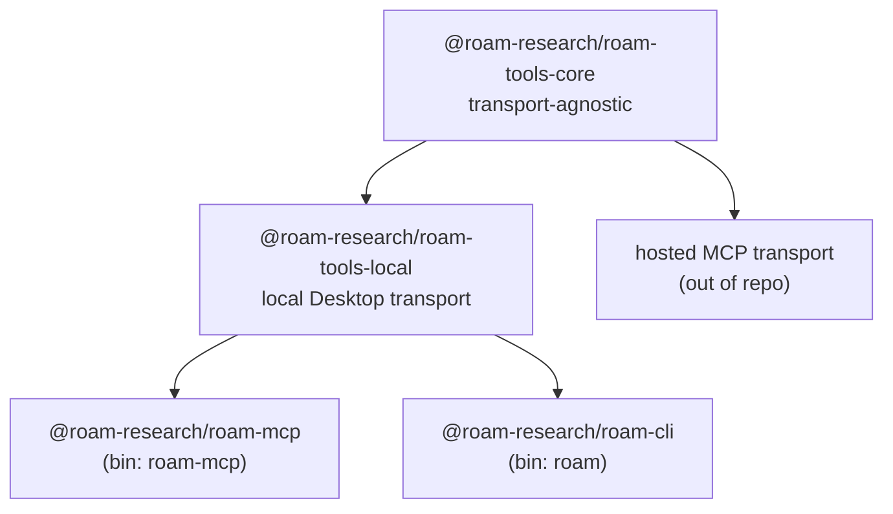
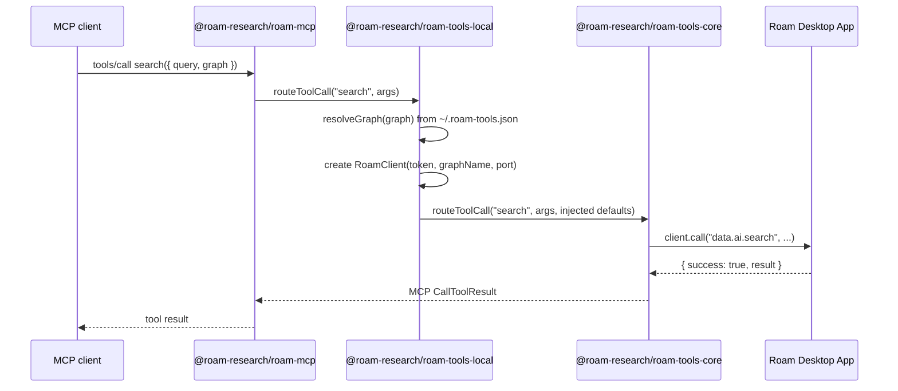

# npm Packaging Design

This doc explains why the npm packages are split the way they are. For the core public contract and hosted-MCP compatibility rules, see [`docs/architecture.md`](architecture.md).

## What This Repository Contains

This is a monorepo with four packages:

1. **Core** (`packages/core/`) — transport-agnostic library: types, Zod schemas, tool registry, operation functions, and `routeToolCall`. It has no local Desktop transport, no config-file reader, and no setup flow.

2. **Local transport** (`packages/local/`) — local Roam Desktop specialization: `RoamClient`, `~/.roam-tools.json` graph resolution, `connect`, and the local standalone graph-management tools. It depends on core.

3. **MCP server** (`packages/mcp/`) — stdio Model Context Protocol server. It imports from local and exposes the combined local tool registry to MCP clients.

4. **CLI** (`packages/cli/`) — Commander.js command-line interface. It imports from local and generates commands from the same tool definitions used by the MCP server.

## Packages

| Package                           | Bin        | Purpose                             | Used by                         |
| --------------------------------- | ---------- | ----------------------------------- | ------------------------------- |
| `@roam-research/roam-tools-core`  | —          | Transport-agnostic core library     | Local package; hosted transport |
| `@roam-research/roam-tools-local` | —          | Local Roam Desktop transport        | MCP and CLI packages            |
| `@roam-research/roam-mcp`         | `roam-mcp` | MCP stdio server                    | MCP clients                     |
| `@roam-research/roam-cli`         | `roam`     | CLI with setup and tool subcommands | Humans and scripts              |

### Why four packages

- Hosted MCP transports can depend on `@roam-research/roam-tools-core` alone and inject their own graph resolver and authenticated client.
- Local-only dependencies (`open`, `@inquirer/prompts`, filesystem config I/O) stay out of core.
- MCP and CLI remain thin wrappers over the local transport, without sharing each other's entrypoint-specific dependencies.
- The local `./connect` subpath keeps prompt dependencies out of normal MCP server startup.
- Sibling package dependencies are pinned exactly so published packages do not silently mix untested versions.

### Architecture



Local MCP tool-call flow:



Hosted transports take the other branch: they import `dataTools` and `routeToolCall` from core, register only transport-safe tools, and provide their own `resolveGraph` and `createClient`.

## Why `@roam-research/roam-mcp`

### npx resolution for scoped packages

When you run `npx @scope/name`, npm resolves the binary by matching the unscoped portion (`name`) against the package's `bin` entries. If it finds a match, it runs that binary.

- Package: `@roam-research/roam-mcp`
- npx looks for bin: `roam-mcp`
- Found -> starts MCP server

This means MCP client configuration is clean and predictable:

```json
{
  "mcpServers": {
    "roam": {
      "command": "npx",
      "args": ["-y", "@roam-research/roam-mcp"]
    }
  }
}
```

No `-p` flag. No explicit binary selection. No ambiguity.

### Why `@roam-research/roam-cli`

Same npx resolution logic:

- Package: `@roam-research/roam-cli`
- npx looks for bin: `roam-cli`, finds no match
- The package has a single `roam` bin, so npx resolves it

```bash
npx @roam-research/roam-cli connect
```

## Why Two Separate Binaries

We considered a single binary where no args starts the MCP server and subcommands run the CLI. We rejected this because:

- `roam` with no arguments should not silently start an MCP server. A human-facing CLI should show help, a wizard, or usage information.
- Future CLI features such as interactive views or background state would conflict with MCP server mode.
- `roam-mcp` starts the server; `roam` is the CLI. Each command has one obvious role.

## Development Mode

The packages use Node.js export conditions so development commands can run TypeScript source without rebuilding after every change:

```text
@roam-research/roam-tools-core
@roam-research/roam-tools-local
  package.json "exports":
    "development" -> ./src/*.ts
    "import"      -> ./dist/*.js
```

`npm run mcp` and `npm run cli` use `tsx --conditions development`, so imports of sibling packages resolve to source TypeScript. Production installs resolve to compiled JavaScript in `dist/`.

Build order is still enforced by TypeScript project references: core -> local -> MCP + CLI.

## Design Decisions

### Why core depends on the MCP SDK

Core re-exports MCP result types like `CallToolResult` because tool definitions and operations return MCP-shaped content. The SDK is needed for these type imports and result shapes, not because core creates an MCP server. Only `packages/mcp` creates an `McpServer` or uses the stdio transport.

### The local `./connect` entry point

The setup flow lives in `@roam-research/roam-tools-local/connect`, not in core. Both binaries use the same flow:

- `roam-mcp connect` dynamically imports `@roam-research/roam-tools-local/connect`, runs setup, then exits before server startup.
- `roam connect` imports the same function from the CLI entrypoint.

This keeps `@inquirer/prompts` out of the normal MCP server path while keeping setup behavior shared.

### Why pinned sibling dependency versions

`@roam-research/roam-tools-local` pins core exactly, and `@roam-research/roam-mcp` / `@roam-research/roam-cli` pin local exactly. These packages are tested and released in lockstep when they are published together; semver ranges would allow untested sibling combinations.

This is separate from the hosted transport's dependency on core. The hosted MCP pins `@roam-research/roam-tools-core` exactly and adopts upgrades deliberately. Core patch releases must still remain contract-safe for other ranged consumers and provide a trustworthy SemVer signal to every reviewer.

### Alternatives considered

**Single package with subpath exports** — simpler publishing, but larger installs, less clear npm identity, and no clean way for a hosted transport to depend only on transport-agnostic code.

**Three packages with local transport in core** — the original split, but it made core carry `RoamClient`, config-file I/O, and setup dependencies that a hosted transport should not bundle.

**Separate git repositories** — true independence, but cross-package changes become publish-and-update choreography with more version drift risk.

**Four-package monorepo (current)** — clear transport boundary with shared development workflow. The main cost is version coordination across the package versions, sibling dependency pins, and binary version strings, handled by `scripts/bump-version.mjs`.

## Usage

### MCP Client Configuration

```json
{
  "mcpServers": {
    "roam": {
      "command": "npx",
      "args": ["-y", "@roam-research/roam-mcp"]
    }
  }
}
```

### CLI

```bash
npx @roam-research/roam-cli connect
npx @roam-research/roam-cli search --query "my notes"
```

### Global Install

```bash
npm install -g @roam-research/roam-mcp    # MCP server
npm install -g @roam-research/roam-cli    # CLI
```

### From Source

```bash
git clone https://github.com/Roam-Research/roam-tools.git
cd roam-tools
npm install
npm run build
npm run mcp                         # MCP server (dev mode)
npm run cli -- connect              # CLI (dev mode)
```

## Config Versioning

The `~/.roam-tools.json` config file includes a `version` field (default: 1). When the local transport reads a config with a higher version than it supports, it throws a clear "please update" error before Zod validation. This prevents confusing schema validation errors when a newer tool has changed the config format.

## Releasing a New Version

Use the version scripts documented in `CLAUDE.md`; they are the source of truth for the current list of version locations.

```bash
npm run version:bump 0.6.5
npm install
npm run version:check
npm run build
npm run typecheck
```

`npm run publish:all` runs `version:check`, builds, then publishes core -> local -> MCP -> CLI.
